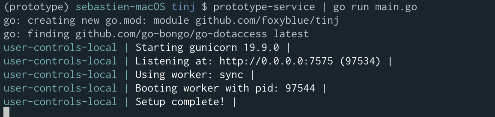

<h1 align="center">
    Tinj
</h1>

<h4 align="center">
    Tinj adds a tinge of colour to newline delimited json streams on stdout.
</h4>

Perfect for JSON structured logs.

```
The command is intended to work with pipes.
Usage: cat <file-name>.json | tinj

Usage:
  tinj [flags]

Flags:
  -f, --format string   Supply a format string
  -h, --help            help for tinj
```


